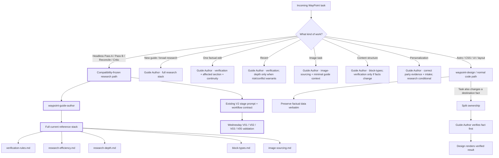
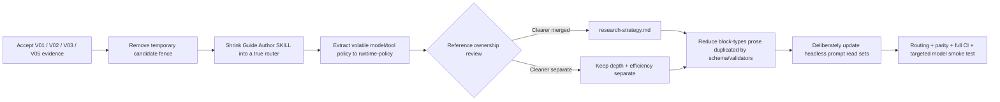

# Agent skill routing — validation-safe paving layer

Status: **ACTIVE PAVING / RESEARCH CANDIDATE FROZEN**  
Applies until the pre-registered V01/V02/V03/V05 model validation runs are accepted.

This document explains the compatibility-preserving routing layer introduced before the model-backed
validation window. It does **not** redefine research doctrine. The current Guide Author skill, V2
stage prompts, and V2 workflow remain the validation candidate and are protected by exact Git blob
checks in `scripts/__tests__/skill-routing.test.mjs`.

## Why this exists

WayPoint needs progressive disclosure so a small task does not load the whole research operating
manual. But changing the headless research instructions immediately before V01/V02/V03/V05 would
change the thing those trials are meant to measure.

So this phase separates two concerns:

1. **Protect the research candidate.** Headless V2 research continues to use the exact current
   Guide Author doctrine and full reference stack.
2. **Pave the routing architecture around it.** Ordinary tasks get a deterministic target context
   in `scripts/skill-routing.mjs`, and presentation work now has a hard design-vs-facts boundary.

## Current routing map



The thick-path concept is intentional: **the model-validation research route is frozen; the routing
work happens around it.**

## Route contract

`scripts/skill-routing.mjs` is the machine-readable paving layer. It is deliberately not wired into
headless workflow execution yet.

Examples:

```bash
node scripts/skill-routing.mjs
node scripts/skill-routing.mjs fact-edit
node scripts/skill-routing.mjs image
node scripts/skill-routing.mjs headless-passA
```

The important behavior is:

| Task | Skill | Required reference scope now | Research candidate affected? |
|---|---|---|---|
| Headless Pass A | Guide Author | Full current stack | **No — frozen** |
| Headless Pass B | Guide Author | Full current stack | **No — frozen** |
| Headless reconcile | Guide Author | Full current stack | **No — frozen** |
| Headless critic | Guide Author | Full current stack | **No — frozen** |
| New guide | Guide Author | Full research stack | No narrowing |
| One factual edit | Guide Author | Verification only + guide/state/continuity | No headless change |
| Recert | Guide Author | Verification; depth conditional | No headless change |
| Cover/photo task | Guide Author | Image sourcing + minimal context | No headless change |
| Content structure | Guide Author | Block types; verification conditional | No headless change |
| Personalization | Guide Author | Correct-party evidence + current intake | No headless change |
| Astro/CSS/UI/layout | Design/code | Design system + affected code | Guide Author does not activate |

## Compatibility fence

Until V01/V02/V03/V05 are accepted, deterministic tests pin the exact Git blob identity of:

- `.claude/skills/waypoint-guide-author/SKILL.md`
- `prompts/research-passA-v2.md`
- `prompts/research-passB-v2.md`
- `prompts/research-reconcile-v2.md`
- `prompts/research-critic-v2.md`
- `.github/workflows/research-pass-v2.yml`

The existing Guide Author mirror-parity test separately ensures the `.agents` copy cannot drift
from the canonical `.claude` copy.

This is intentionally temporary. After the model-backed validation evidence is accepted, removing
or updating the fence must be an explicit architecture decision rather than an incidental cleanup.

## What changed in this paving phase

- Added a deterministic route map for future progressive disclosure.
- Added regression tests proving narrow tasks resolve to narrow context while headless research
  retains the full stack.
- Added exact-content checks protecting the pre-registered V2 validation candidate.
- Clarified `waypoint-design`: presentation-only work preserves factual data verbatim; creating,
  correcting, or verifying destination facts routes to `waypoint-guide-author`; mixed tasks split
  ownership rather than allowing design work to silently become research work.

## What is deliberately deferred until after validation



Deferred does **not** mean forgotten. It means those changes can alter the research candidate and
therefore belong after the controlled validation evidence, not immediately before it.

## Governing invariant

> **Progressive disclosure reduces instruction loading, not investigative ambition.**

A narrow task should see dramatically less irrelevant context. A new-guide or headless research
run must still be able to investigate as broadly and deeply as destination complexity, traveler
needs, uncertainty, evidence conflict, and risk require.
